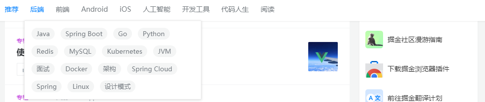

# 产品介绍
##  IntInfo产品是一个帮助开发者成长的社区，是给开发者用的HACKER NEWS，是给设计师用的DESIGNER NEWS，和给产品经理用的MEDIUM

vue + Element-ui + vuex + vue-router 开发IntInfo官网

# 前端PC端
## 首页
- 头部导航（nav）
- 登陆按钮
- 注册按钮
- 搜索框 （search）
- 头部轮播图（banner）
- 热门语言区域（Popular）
## 活动
- 暂无
## 问答
- 问答列表（提问列表）
- 问答文本域（Text）
## 技术栈（所有技术的集合）
- 技术分类 （如前端、后端、Android\iOS、人工智能.......）
- 技术子分类 （如前端有html、css、javascript、vue......）

- 技术分享卡片 （card）

- 技术栈列表排序（热门排序、最新排序）

## 排行榜
- 对在本平台做出的贡献或者主页访问人数较多的用户进行一个排行
- 对文章进行排行（在所有文章中进行浏览人数、评论人数、点赞人数进行排行）
## 关于我们
- 有开发者名单（开发团队）
- 产品介绍

